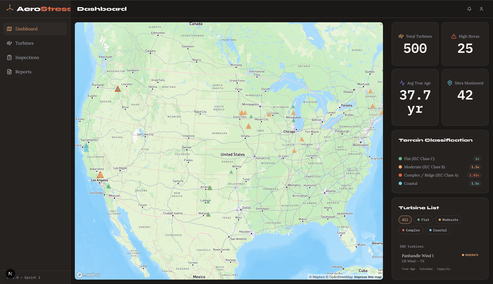

# AeroStress



> Predictive maintenance platform that calculates the "True Age" of wind turbines based on terrain-specific stress, helping asset managers prioritize inspections before failures happen.

  

---

## The Problem

There are 75,417+ wind turbines operating across the US (USWTDB). Standard SCADA maintenance software treats every turbine the same — a 10-year-old turbine on a flat plain gets the same inspection schedule as a 10-year-old turbine on a mountain ridge. But ridge and coastal turbines experience up to 2x the mechanical stress due to turbulence (IEC 61400-1). Without terrain-adjusted aging data, asset managers have no way to know which turbines are silently deteriorating faster than their calendar age suggests.

## What It Does

AeroStress gives wind farm asset managers a single dashboard to see which turbines are aging faster than expected. Each turbine gets a **True Age** score — calendar age multiplied by a terrain stress factor — so a 10-year turbine on complex terrain might show a True Age of 18.5 years. Managers can filter the heatmap by terrain class, drill into individual turbines to see failure predictions, and dispatch inspections directly from the platform.

## Key Features

| Feature | What It Does |
|---------|-------------|
| Stress Heatmap | Mapbox GL map with SDF triangle markers colored by terrain class, sized by stress multiplier |
| True Age Scoring | Per-turbine age calculation using IEC terrain multipliers (flat 1.0x, moderate 1.3x, complex 1.85x, coastal 1.5x) |
| Turbine Detail View | Breakdown of True Age vs Calendar Age, terrain badge, stress explanation, and failure predictions |
| Inspection CRUD | Create, view, and update inspections with photo upload and severity ratings |
| PDF Reports | Download inspection reports generated server-side via Puppeteer |
| Terrain Filters | Toggle terrain classes on the heatmap to isolate high-risk clusters |

## Tech Stack

| Layer | Technology | Why |
|-------|-----------|-----|
| Frontend | Next.js 16, TypeScript | App Router for file-based routing; React Server Components for data-heavy dashboard pages |
| Styling | Tailwind CSS v4 | CSS-based theme tokens (`@theme`) — no config file needed; design system maps directly to utility classes |
| State | Zustand | Slice pattern keeps map viewport, turbine data, and inspection drafts in isolated stores without Redux boilerplate |
| Maps | Mapbox GL JS | WebGL rendering handles 500+ markers smoothly; SDF image support for custom triangle markers with terrain-colored tinting |
| Backend | FastAPI, Python | Async endpoints for turbine queries; easy integration with PostGIS spatial functions |
| Database | Supabase / PostGIS | Row-level security, real-time subscriptions (planned), and geospatial queries on turbine coordinates |
| Deployment | Vercel | Zero-config Next.js deploys with preview URLs per branch |

## Architecture

```
                    ┌─────────────────┐
                    │   Asset Manager  │
                    │   (Browser)      │
                    └────────┬────────┘
                             │
                    ┌────────▼────────┐
                    │  Next.js 16     │
                    │  Dashboard      │
                    │  (Vercel)       │
                    └───┬────────┬───┘
                        │        │
               ┌────────▼──┐  ┌─▼──────────┐
               │  FastAPI   │  │  Mapbox GL  │
               │  (Python)  │  │  (WebGL)    │
               └────────┬───┘  └────────────┘
                        │
               ┌────────▼────────┐
               │  Supabase       │
               │  PostgreSQL +   │
               │  PostGIS        │
               └─────────────────┘
```

## Technical Decisions

**SDF triangle markers** over default Mapbox circle markers
**Why:** Triangles convey directionality (future wind direction rotation) and are easier tap targets on mobile. SDF (signed distance field) images allow per-marker color tinting via Mapbox's `icon-color` property, so a single image asset handles all four terrain colors without loading multiple sprites.

**Zustand slice pattern** over Redux or React Context
**Why:** The app has three independent data domains — map viewport, turbine/fleet data, and inspection draft state. Zustand slices keep each store focused with zero boilerplate. No providers needed, and stores are accessible outside React components (useful for map event handlers).

**Tailwind v4 CSS-based tokens** over tailwind.config.ts
**Why:** All design tokens (terrain colors, brand palette, font families) live in `@theme` inside `globals.css`. This eliminates the config file entirely and makes tokens available as CSS custom properties, which Mapbox popup styling and non-Tailwind contexts can reference directly.

## Getting Started

### Prerequisites
- Node.js 18+
- npm or yarn
- Mapbox access token ([mapbox.com/account](https://account.mapbox.com/))
- Supabase project URL and anon key (or use mock data mode)

### Installation
```bash
git clone https://github.com/jonelrichardson/AeroStress.git
cd AeroStress
npm install
```

### Environment Variables
Create a `.env.local` file:
```
NEXT_PUBLIC_MAPBOX_ACCESS_TOKEN=your_mapbox_token
NEXT_PUBLIC_SUPABASE_URL=your_supabase_url
NEXT_PUBLIC_SUPABASE_ANON_KEY=your_supabase_anon_key
```

### Run Locally
```bash
npm run dev
# Open http://127.0.0.1:3000
```

> The app falls back to 500 mock turbines when Supabase is unavailable, so the dashboard is fully functional without backend credentials.

## What I'd Build Next

- **USGS elevation integration** — replace the current latitude-based terrain heuristic with real DEM (Digital Elevation Model) data for accurate terrain classification
- **Offline inspection sync** — use Supabase realtime subscriptions + AsyncStorage in the Expo app so technicians can submit inspections from remote sites without connectivity
- **Fleet cost projections** — surface the `/fleets/{id}/projected-savings` endpoint as an interactive chart showing how predictive maintenance reallocates O&M budgets toward high-risk turbines
- **Expo mobile app** — React Native / Expo app for field technicians to submit inspections on-site with shared TypeScript types from the web dashboard

## About This Project

Built during Pursuit's AI-Native Builder Fellowship (Spring 2026) as a 3-person team. I was the **frontend lead**: built the Mapbox stress heatmap with SDF triangle markers, turbine detail pages with True Age breakdowns, inspection CRUD with photo upload, and the PDF report download flow. Pape owned the FastAPI backend and Supabase data layer; Jagger built the Puppeteer PDF generation service.

**My role:** Frontend lead — Next.js dashboard, Mapbox GL integration, and inspection workflow.

---

Built by [Jonel Richardson](https://linkedin.com/in/jonel-richardson)
